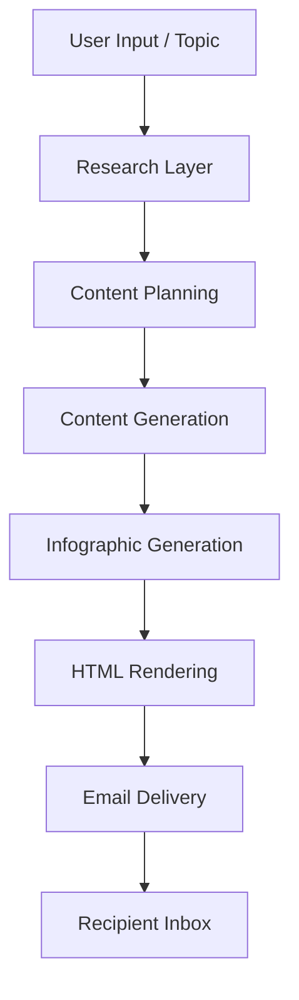
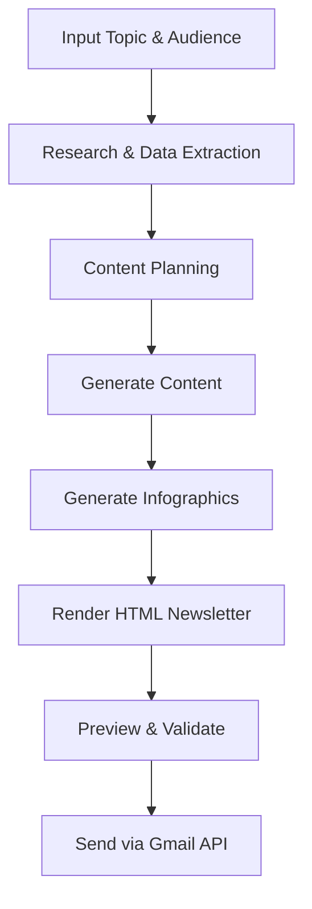

# AI Content Automation System – Newsletter Workflow

An AI-powered system that automates end-to-end newsletter creation, from topic research to content generation, infographic creation, and email delivery using a modular workflow architecture.

---

## Overview

This project implements a production-style AI automation pipeline that transforms a single topic input into a fully structured, styled, and deliverable HTML newsletter.

It demonstrates real-world applications of AI agents, workflow orchestration, and API-driven automation systems.

---

## Architecture

The system follows a modular pipeline design:

- Research Layer → Collects structured insights using external APIs  
- Planning Layer → Organizes content into sections and structure  
- Generation Layer → Produces high-quality HTML content using LLMs  
- Infographic Layer → Generates supporting visuals  
- Rendering Layer → Converts content into styled HTML newsletters  
- Delivery Layer → Sends emails via Gmail API  

---

## System Flow

---

## Workflow Process

---

## Features

- Automated topic research using external APIs  
- Structured content generation using LLMs  
- AI-generated infographics with fallback support  
- Branded HTML email rendering  
- Gmail API integration with draft-first safety  
- Modular and extensible workflow architecture  

---

## Project Structure

.tmp/              # Temporary processing files  
tools/             # Python scripts (execution layer)  
workflows/         # Workflow definitions  
brand_assets/      # Branding (logo, styles, templates)  
reports/           # Generated outputs  
.env               # API keys and environment variables  

---

## Tech Stack

- Python  
- Claude (LLM for content generation)  
- Perplexity API (research)  
- Gmail API (email delivery)  
- Jinja2, Premailer (HTML rendering)  
- Pillow / AI APIs (image generation)  
- BeautifulSoup (HTML processing)  

---

## Setup

### 1. Clone the repository

git clone https://github.com/asadcs/ai-content-automation-system.git  
cd ai-content-automation-system  

### 2. Install dependencies

pip install -r requirements.txt  

### 3. Configure environment variables

PERPLEXITY_API_KEY=your_key  
GMAIL_SENDER_ADDRESS=your_email  
GMAIL_RECIPIENT_ADDRESS=recipient_email  

### 4. Add Google credentials

- Place credentials.json in the root directory  
- Enable Gmail API in Google Cloud Console  

---

## Usage

python tools/research_topic.py --topic "AI agents" --audience "tech professionals"  

python tools/generate_infographics.py --prompts-json .tmp/image_prompts.json  

python tools/generate_newsletter_html.py --content .tmp/content.json --images-dir .tmp/  

python tools/preview_newsletter.py --file .tmp/newsletter.html  

python tools/send_gmail.py --html-file .tmp/newsletter.html --subject "Your Subject"  

---

## Use Case

Built for automating content workflows in marketing and AI-driven businesses, enabling scalable and consistent newsletter production.

---

## Key Learnings

- Designing modular AI workflows  
- Using LLMs for structured content generation  
- Integrating multiple APIs into a pipeline  
- Building production-style automation systems  

---

## Security Notes

- .env and API keys are excluded via .gitignore  
- OAuth credentials stored locally (token.json)  

---

## Future Improvements

- Web dashboard  
- Scheduling automation  
- Analytics tracking  
- CRM integration  

---

## Author

Muhammad Asadullah
